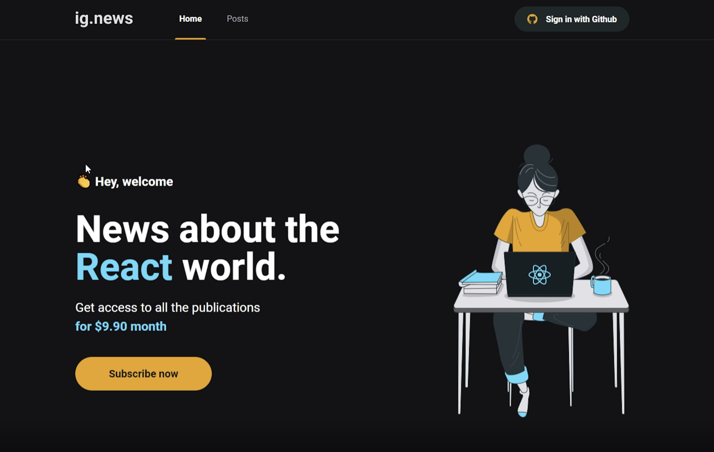

<h1 align="center">
  IgNews
</h1>

<p align="center">
  <a href="#-tecnologias">Tecnologias</a>&nbsp;&nbsp;&nbsp;|&nbsp;&nbsp;&nbsp;
  <a href="#-projeto">Projeto</a>&nbsp;&nbsp;&nbsp;|&nbsp;&nbsp;&nbsp;
  <a href="#-executando">Executando</a>&nbsp;&nbsp;&nbsp;
</p>

<p align="center">
 

  
</p>

<br>

## 🚀 Tecnologias

Esse projeto foi desenvolvido com as seguintes tecnologias:

- ReactJS
- NextJS
- TypeScript
- SASS
- Next-Auth
- Stripe
- FaunaDB
- Prismic CMS
- Github Authentication

## 🔖 Projeto

O projeto tem como objetivo o estudo e desenvolvimento de uma aplicação com ReactJS e NextJS para listagem de posts e sistema de assinatura em um blog de notícias. Onde os usuários pagam para ter acesso. O acesso às postagens é liberado quando há uma inscrição ativa no Stripe. Caso não exista assinatura ativa para o usuário logado a partir do Github, só será exibido apenas um resumo das notícias ao usuário.

Os meios de pagamento da aplicação são integrados com a API do Stripe, e utilizado o FaunaDB para armazenar as informações. As postagens são exibidas a partir do CMS Prismic.io.

A aplicação foi construída com modelo Serveless, sem necessidade de criar uma API externa para manipular os dados 🚀

<p align="center">
  
</p>

## 💻 Executando

O projeto foi criado utilizando o NextJS

```sh
  # Clone this project
$ git clone git@github.com:diegoalmda/rjs-ignite-ignews.git
# Access
$ cd ignews
# Install dependencies
$ yarn install
# Run the project
$ yarn dev
# The server will initialize in the <http://localhost:3000>
```
Testar o projeto em funcionamento -> [IGNews](https://ignews-challenge-diegoalmda.vercel.app/)


Feito por Diego Almeida :wave: #TrilhaIgnite #Rocketseat 🚀